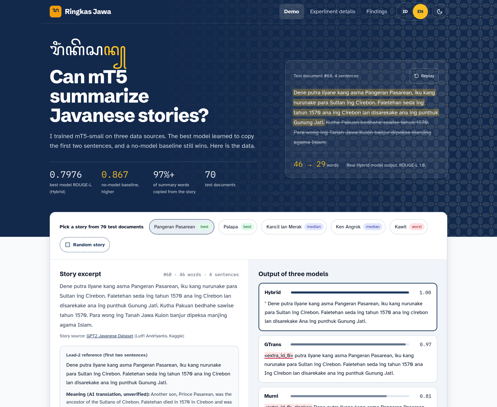

# Ringkas Jawa

Javanese Story Summarization Research Showcase



## About the Project

This project presents the output of my undergraduate thesis on automatic summarization of Javanese-language stories. I fine-tuned `google/mt5-small` on three training sets: original Javanese stories (Murni, 633 pairs), Google-translated stories (GTrans, 1,000 pairs), and both combined (Hybrid, 1,633 pairs). All three models were evaluated on the same 70 held-out Javanese stories, with the first two sentences of each story (lead-2) as the reference summary.

The main feature of the project is a demo that shows the real outputs of the three models side by side, together with the experiment results. The results are presented honestly: the models mostly learned to copy the opening of each story, and the plain lead-2 baseline (ROUGE-L 0.867) still scores higher than the best model (Hybrid, ROUGE-L 0.7976).

## Feature Requirements

1. Summarization Demo
   * 5 featured test stories (best, median, worst) and a random story from the 70
   * Story excerpt, lead-2 reference, and an AI helper translation (featured stories only)
   * Outputs of the three models with per-document ROUGE-L, with words that differ from the reference highlighted
2. Research Stats
   * Best model score: Hybrid ROUGE-L 0.7976
   * No-model lead-2 baseline: ROUGE-L 0.867
   * Share of summary words copied from the story: 97%+
   * Number of test documents: 70
3. Findings
   * Leftover pretraining token `<extra_id_0>` (70/70 Murni, 67/70 GTrans outputs)
   * First word replaced by "Aku" (50/70 Hybrid outputs)
   * Almost no new words (new 1-grams: Murni 0.9%, GTrans 1.5%, Hybrid 3.0%)
   * Documents below ROUGE-L 0.5 explained by the lead-2 sentence filter (Murni 36, GTrans 16, Hybrid 9)
4. Experiment Details
   * Score card per scenario, compared with the baseline
   * Training data size vs. ROUGE-L chart
   * Validation ROUGE-L and loss per epoch
   * New n-gram table and full scenario table (ROUGE-1, ROUGE-2, ROUGE-L)
   * Training configuration and limitations
5. Language and Theme
   * Indonesian and English (follows the browser, with a toggle)
   * Light and dark mode

## UI Requirements

1. Navigation Bar (Demo, Experiment details, Findings, language toggle, theme toggle)
2. Hero Section (short explanation of the research, key stats, and a before/after summary of one test story) (Feature 2)
3. Summarizer (Feature 1)
4. Findings (Feature 3)
5. Behind the Scenes (why it matters, the problem, key decisions, what happened, what to do next time)
6. Experiment Details (Feature 4)
7. Footer (author, study program, university, journal status, dataset credit)

Note:

* Points 1 to 5 and 7 are on the landing page, while Experiment Details has its own dedicated page.
* Every number on the site comes from a single data file, and the findings counts are checked against the stored model outputs by tests.
* The stories come from the [GPT2 Javanese Dataset](https://www.kaggle.com/datasets/lutfiandri/gpt2-javanese-dataset) (Lutfi Andriyanto, Kaggle). Its license is listed as "Unknown", so the site credits the source and shows the stories only as excerpts for research purposes.
* The helper translations are AI-generated and marked as unverified on the site.

## Technical Details

* Backend: none (static site, all data bundled as JSON at build time)
* Frontend: Vite + React 19 + TypeScript
* Styling: plain CSS with custom properties (no UI framework)
* Charts: hand-built SVG (no chart library)
* Testing: Vitest (unit tests, plus security and Content-Security-Policy checks)
* Fonts: self-hosted (Atkinson Hyperlegible, IBM Plex Mono, Schibsted Grotesk, Noto Sans Javanese), SIL Open Font License
* Research model: `google/mt5-small`, fine-tuned with Hugging Face Transformers on Google Colab (T4 GPU)

## Current State

* Demo page and Experiment Details page are complete, in Indonesian and English, light and dark
* Accessibility, contrast, performance, and security audit done (self-hosted fonts, strict Content-Security-Policy, no third-party requests)
* 54 unit tests passing
* Deploys to GitHub Pages automatically on every push to `main` (lint and tests must pass first); not live yet
* Journal article based on this thesis (MATICS) is in progress

## Running Locally

Requires Node.js 20.19+ or 22.12+. From the project folder:

```bash
npm ci
```

```bash
npm run dev
```

Then open <http://localhost:5173>. Other commands: `npm run build` (production build into `dist/`), `npm run preview` (serve the build), `npm run test`, `npm run lint`.
